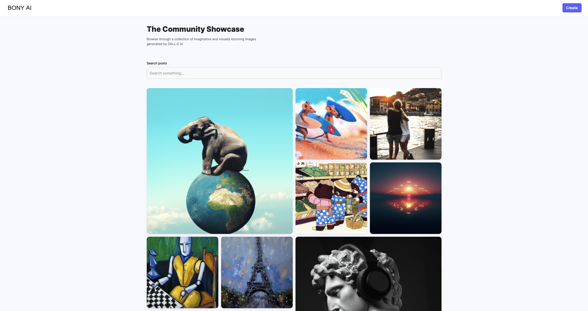
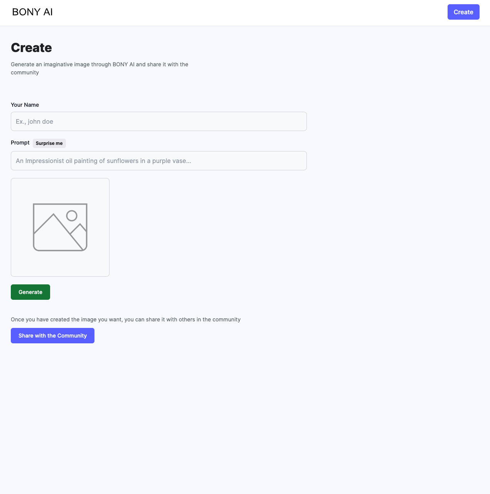

<!-- CUSTOMGPT -->
# Bony

Bony is a DALL-E Clone like social app that can generate images using the OpenAI's API for DALL-E to generate image from a text prompt and share with the community.

</br>

<!-- GETTING STARTED -->
## Getting Started

In order to have an API key that will work OpenAI charges for their API usage,

so in order for this to work you will have to pay unfortunatly.

Before you can use this you need to have an account with OpenAI and create a new API KEY.

You can create an account with OpenAI [Here](https://platform.openai.com/)

Once you sign up you can now create a new API KEY [Here](https://platform.openai.com/account/api-keys)

Make sure you save the API KEY once you see it you can't see it again, save it for now we will use this later.

</br>

<!-- PREREQUISITES -->
## Initial Setup

This application uses MERN stack and cloudinary to upload all the images as urls for scalability.
You would need the following setup for the application to work.

1. A MongoDB account with a working cluster

2. A Cloudinary account

Thats it!

<!-- INSTALLATION -->
## Installation

1. Clone the repo

    ```bash
    git clone https://github.com/royshemtov13/bony.git
    ```

2. CD into the server and client folders independently and install their npm packages

    ```bash
    npm install
    ```

3. Create a .env file in the server folder and insert the environment variables as follows

    ```bash
    MONGODB_URL=""
    OPENAI_API_KEY=""
    CLOUDINARY_CLOUD_NAME=""
    CLOUDINARY_API_KEY=""
    CLOUDINARY_API_SECRET=""
    ```

Great! You're all set

</br>

<!-- USAGE -->
## Usage

Once you have all that set and done you can run your app

You need to run the Client and the Server, CD into each one on two different terminals and do the following

Server

```bash
npm start
```

Client

```bash
npm run dev
```

You will recieve something that looks like this for the client

```bash
$ npm run dev

> client@0.0.0 dev
> vite


  VITE v4.4.9  ready in 372 ms

  ➜  Local:   http://localhost:PORT-NUMBER/
  ➜  Network: use --host to expose
  ➜  press h to show help
```

And something that looks like this for the server

```bash
$ npm start

> server@1.0.0 start
> nodemon index

[nodemon] 3.0.1
[nodemon] to restart at any time, enter `rs`
[nodemon] watching path(s): *.*
[nodemon] watching extensions: js,mjs,cjs,json
[nodemon] starting `node index.js`
Server started on port http://localhost:PORT-NUMBER/
MongoDB connected

```

If you see these prompts back to use from the terminal that means you have successfuly started the backend and frontend!

Now you can go to <http://localhost:5173> and you will see the opening site.

You should see something like this (Ignore the images for now those are images that I generated).

Your page should be empty of any images not like mine.



Then you can click on the create button on the top right just like on the image and you will be redirected here


Enter your name and a prompt and click the green Generate button.

Once you liked the picture generated in the small image box click on Share with the Community.

This will redirect you to the homepage where you will find your new generated image shared on the homepage!

</br>

<!-- CONTRIBUTING -->
## Contributing

Contributions are what make the open source community such an amazing place to learn, inspire, and create. Any contributions you make are **greatly appreciated**.

If you have a suggestion that would make this better, please fork the repo and create a pull request. You can also simply open an issue with the tag "enhancement".
Don't forget to give the project a star! Thanks again!

1. Fork the Project
2. Create your Feature Branch (`git checkout -b feature/AmazingFeature`)
3. Commit your Changes (`git commit -m 'Add some AmazingFeature'`)
4. Push to the Branch (`git push origin feature/AmazingFeature`)
5. Open a Pull Request

</br>
